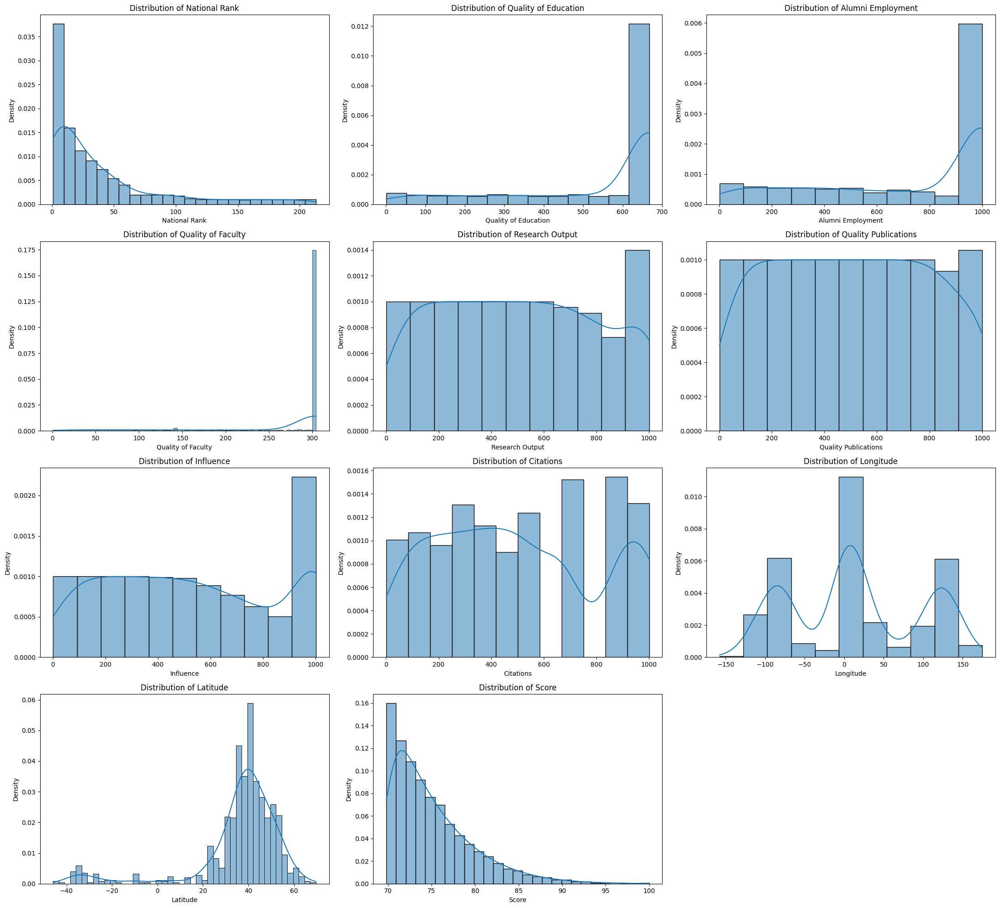
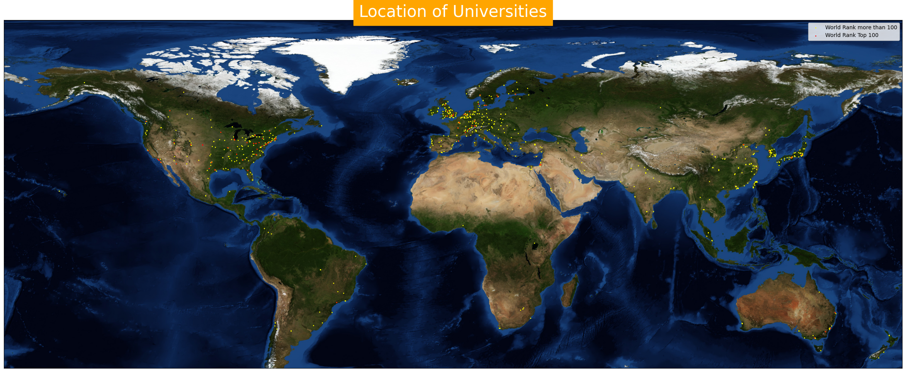
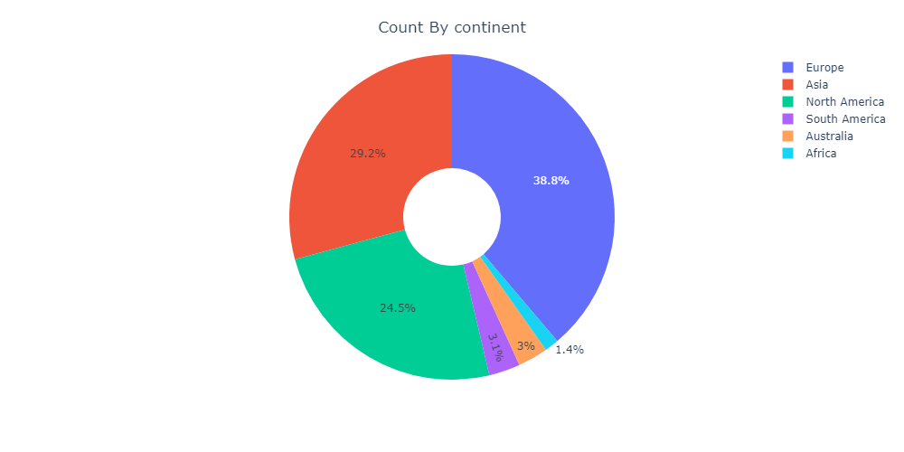
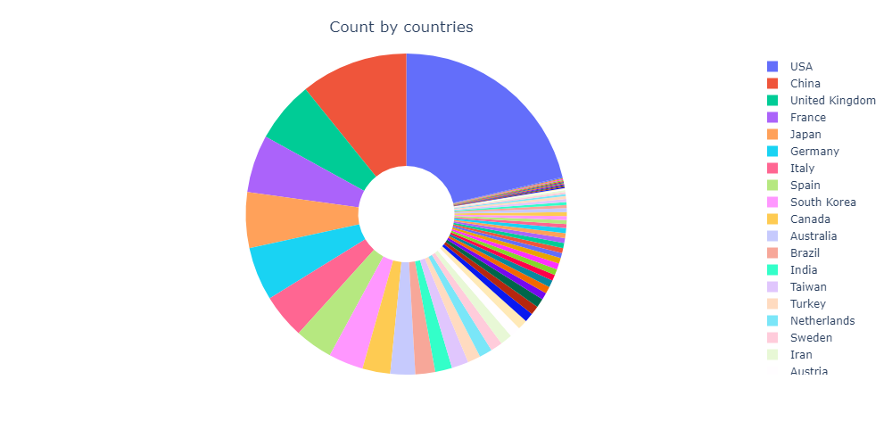

# University Ranking Data Science Project

This project aims to analyze university rankings using data science techniques. The code is written in Python and utilizes various libraries for data manipulation, visualization, and geolocation.

## Getting Started

To run the code, follow the instructions below:

1. Install the required libraries mentioned in the `Import libraries` section of the code. You can use package managers like pip or conda to install them.

2. Ensure that the necessary datasets are available. The code expects a dataset containing university ranking information in a tabular format.

3. Execute the code cells sequentially to perform data analysis and visualization.

## Code Overview

The code is organized into several sections, each serving a specific purpose:

1. **Import libraries**: This section imports the necessary Python libraries for data analysis and visualization. The imported libraries include pandas, numpy, seaborn, matplotlib, plotly, pycountry, pycountry_convert, mpl_toolkits, geopy, and random.

2. **Import Datasets**: This section imports the university ranking dataset. The dataset is expected to contain information such as world rank, institution name, location, national rank, quality of education, alumni employment, quality of faculty, research output, quality publications, influence, citations, and a score.

3. **Data Analysis and Visualization**: This section performs various data analysis tasks and creates visualizations using the imported dataset. The code uses functions from the imported libraries to explore and visualize the data. Examples of tasks include plotting rankings on a world map, creating bar charts, and generating scatter plots.

## Dependencies

The code relies on the following Python libraries:

- pandas: For data manipulation and analysis.
- numpy: For numerical operations.
- seaborn: For statistical data visualization.
- matplotlib: For creating static, animated, and interactive visualizations.
- plotly: For interactive and web-based visualizations.
- pycountry: For country-related data and information.
- pycountry_convert: For converting country names and codes.
- mpl_toolkits: For basemap plotting.
- geopy: For geocoding and reverse geocoding.
- random: For generating random numbers.

Ensure that these libraries are installed in your Python environment before running the code.

## Dataset

The code expects a dataset containing university ranking information. The dataset should be in a tabular format, with columns representing different attributes of the universities. The provided sample dataset includes columns such as world rank, institution name, location, national rank, quality of education, alumni employment, quality of faculty, research output, quality publications, influence, citations, and a score.

## Some outputs

## License

This code is provided under the [MIT License](https://opensource.org/licenses/MIT). Feel free to modify and use it according to your needs.

## Acknowledgments

This project was developed as a data science project for university ranking analysis. The code and documentation were created by "Mohammadaref Ahmadpoor".
